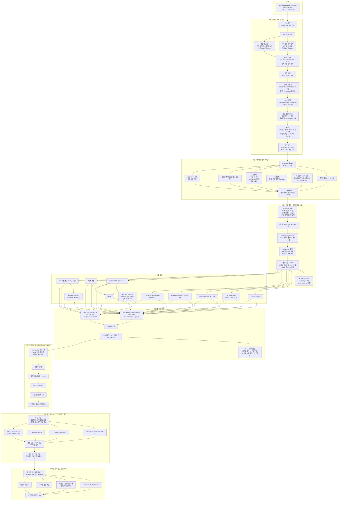
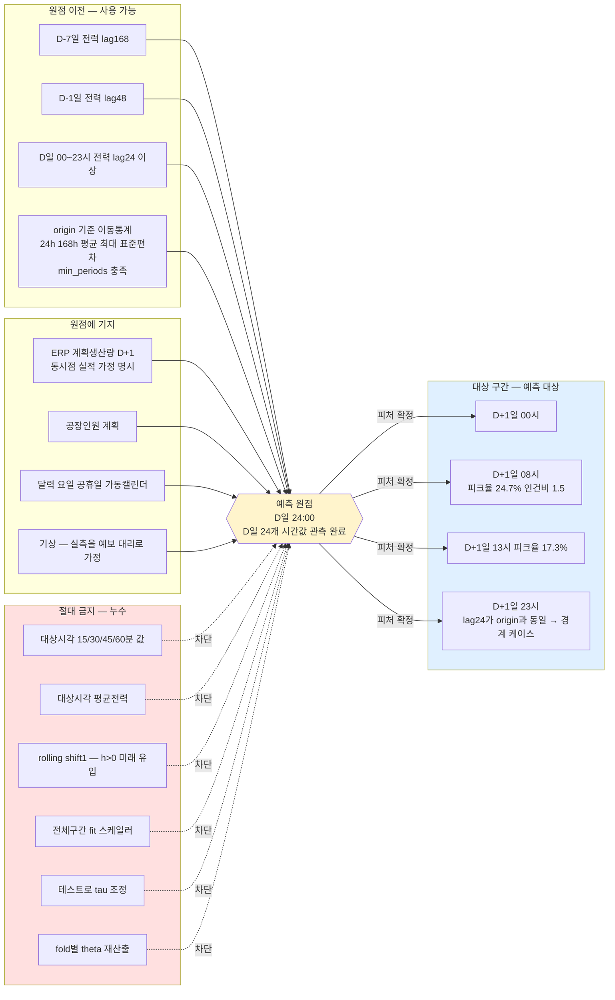
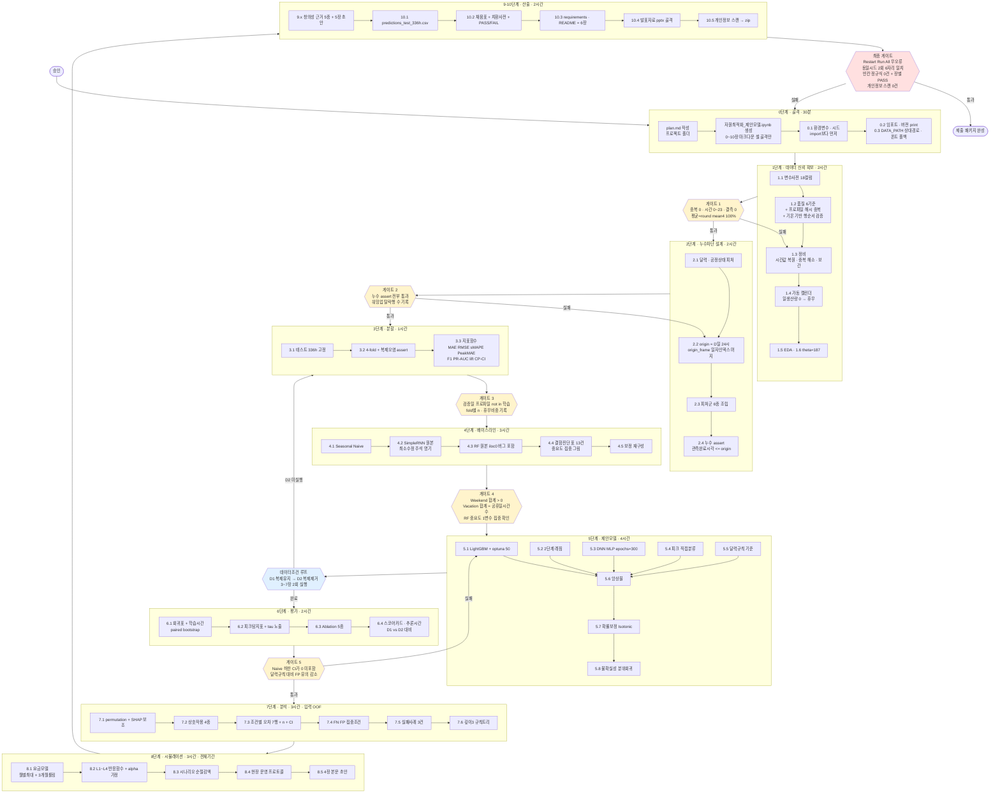
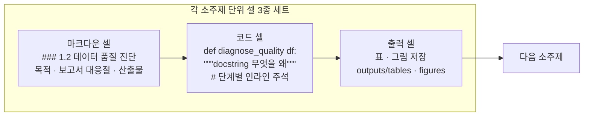

# KAMP 제6회 경진대회 ⑤ 자원 최적화 — 방법론 구현 계획

## Context

**왜 이 작업을 하는가.** 사용자는 이미 `경진대회 결과보고서 양식_...pdf` 10쪽에 과제 ⑤(제조 생산데이터 기반 전력사용량 예측 및 최대피크 위험조건 분석)의 **방법론을 확정해 서술**해 두었다. 다만 모든 수치가 `[TBD]`로 비어 있고 제4·5·6장(합계 30점)은 양식 안내문만 남은 공란이다. 이 작업의 목표는 새 방법론 설계가 아니라 **보고서에 이미 확정된 방법론을 KAMP 가이드북 베이스라인 위에 구현하여 모든 빈칸을 실측값으로 채우는 것**이다.

**산출 기대물.** 심사위원이 단일 노트북을 `Restart Kernel → Run All`하면 전처리→학습→추론→결과생성이 자동 완료되고, 보고서 1~6장의 모든 표·수치·본문 초안이 `outputs/`에 생성된다.

**제약.** 마감 2026-10-08 23:59. 제출물 4종: ①보고서 PDF ②소스코드 zip(코드+requirements.txt+학습용 데이터+README+예측결과 파일) ③발표자료 PDF+PPT ④설문 캡처. **블라인드 평가** — 소속·학교·로고 등 식별정보 기재 금지(성명·팀명만 허용).

---

## 1. 사전 검증 — 보고서 주장의 실측 대조

보고서의 **모든 정량 주장이 원본 CSV와 일치**함을 확인했다. 구현 시 재현해야 할 기준값이다.

| 보고서 주장 | 실측 | |
|---|---|---|
| 시계열 6,168건 | 6,168행 × 18열 (257일 × 24시간, 2021-01-01~09-14) | ✅ |
| 결측: 풍속 3, 강수량 1, 공장인원 17 | 동일 | ✅ |
| 날짜·시간 중복 5건 | `(날짜,시간)` 중복 5쌍 | ✅ |
| 7/13·7/15 48행 시간값 70~188 | 정확히 48행, 두 날짜 각 24행 | ✅ |
| 생산량 0인 시간 43% / 평균전력 30 미만 33% | 43.1% / 33.2% | ✅ |
| 15분 최대전력 상위5%=187, 상위1%=201, 최대=222 | **`peak15=max(15,30,45,60분)`** 기준 187.0 / 201.0 / 222 | ✅ |
| 생산량–평균전력 0.52 / 기온–평균전력 0.05 | 0.518 / 0.053 | ✅ |
| 평일 103~123 / 토 51 / 일 41 | 월113.3 화115.6 수107.5 목123.0 금103.2 토51.1 일41.3 | ✅ |
| 8시·13시 재가동 증가, 12시·17시 감소 | 7시 87.6→**8시 121.3**, 11시 120.4→**12시 77.0**→**13시 118.6**, 16시 112.5→17시 93.8 | ✅ |
| 평균전력 ≈ 4개 15분값 관계 (무결성) | `평균 = round(mean(4개))`, 100% 오차 ≤0.5 | ✅ |

**⚠️ 타깃 정의 확정**: `peak15 = max(15분,30분,45분,60분)`일 때만 187/201/222가 재현된다. `15분` 단일 컬럼은 173.6/188/207로 불일치 — 베이스라인은 `15분`만 쓰므로 **따라가면 안 된다**. 보고서 1.1절에 각주로 정의 명시.

---

## 2. 신규 발견 — 계획을 바꾸는 6가지

### 🔴 발견 1 — 데이터의 44.7%가 합성 복제일이다 (가장 중요)

파일명 `okm_**augumented**_2021.csv`가 시사하듯, **24시간 전력 프로파일이 byte 단위로 동일한 날이 대량 존재**한다.

- **고유 일 프로파일 142 / 257일**, 중복그룹 45개, 관련 160일, **잉여(복제) 115일 = 44.7%**
- 그룹 크기 분포: `{2일:12, 3일:16, 4일:11, 5일:2, 6일:2, 7일:1, 15일:1}`
- **최대 그룹 15일**: `01-05, 01-06, 01-12, 01-13, 01-19, 01-20, 01-26, 01-27, 01-31, 03-05, 03-12, 03-19, 03-26, 03-31, 05-30` — 기온이 **-3.4°C ~ 19.2°C**로 완전히 다른데 전력은 동일
- 행 단위 완전중복(18열)은 0건이라 **일반 `duplicated()`로는 절대 잡히지 않는다**

**폴드 오염 실측** (검증일 프로파일이 학습구간에 이미 존재하는 비율):

| fold1 | fold2 | fold3 | fold4 | fold5 | TEST |
|---|---|---|---|---|---|
| **7/14일 (50%)** | 0% | 0% | 0% | 0% | **0%** |

➡️ **대응**
1. 노트북 1.2절에 **일 단위 전력 프로파일 해시 중복 검사** 셀 추가 → 142/257·복제 115일을 표로 출력.
2. 보고서 1.4절 '유일성' 행을 **"(날짜,시간) 중복 5건 + 24시간 전력 프로파일 복제 115일"**로 수정. 단 이는 오류가 아니라 **증강(augmentation) 구조**이므로 "무결성 33.3%→100%" 문장을 **"복제 구조를 진단하고 학습 설계에 반영"**으로 교체.
3. **fold1은 폐기하고 4-fold로 축소**(또는 검증 시작을 07-01로 이동). 3.2절에 `검증일 프로파일 ∉ 학습구간` assert 셀 배치.
4. 보고서 1.6절에 **실질 학습 표본이 명목의 약 53%**임을 한계로 명시.

> **⚠️ 내 앞선 추정 정정**: 1월 화·수요일과 3월 금요일에 전력 21.9가 반복되는 것을 "주 단위 교대 휴무 패턴"으로 봤으나, 실제로는 **위 15일짜리 단일 복제 그룹**이다. 실재하는 근무 패턴이 아니므로 피처로 만들면 안 된다.

### 🔴 발견 2 — 9월 테스트 구간만으로는 기본요금 절감액이 **0원**이다

요금모델("3개월 최대피크 기준 12개월 청구", 가이드북 셀 1)과 결합하면 논리적으로 절감이 0이 된다.

| 월 | 1 | 2 | 3 | 4 | 5 | 6 | 7 | 8 | **9(테스트)** |
|---|---|---|---|---|---|---|---|---|---|
| 최대 peak15 | **222** | 198 | **222** | 199 | 199 | **222** | **222** | 218 | **204** |

- 전체 최대 **222**, 도달 4건: `01-29 08시`, `03-29 08시`, `06-29 08시`, `07-19 11시`
- 상위 12개 피크 중 **8개가 08시 또는 11시**, 222 3건이 모두 **"월말 29일 08시"**
- 7~9월 3개월 창 최대 = **222(7월)** → **9월의 204를 0으로 낮춰도 청구 피크는 불변**

➡️ **대응**: 8장 시뮬레이션 대상을 **전체 기간(01-01~09-14)의 실측 `peak15` 시계열**로 확대. ①월별 최대수요 + 직전 3개월 롤링 최대 두 청구 단위 산출, ②저감 타깃 = **연중 상위 N개 피크 시각 전부**, ③9월 테스트 결과는 "모델 예측 기반 운영 시나리오 검증"으로만 제시하되 **"이 구간 단독으로는 연간 기본요금에 영향 없음"을 명시**(정직성 가점), ④내용요약의 `[TBD] kW`를 전체기간 기준으로 재정의.

### 🔴 발견 3 — 7/13·7/15는 ERP측 결측일이며, 피크 임계값 187이 여기에 달려 있다

`평균==0`인 17행(08-28 18시~08-29 10시 연속)이 **센서측 계측정지**인 것과 **대칭으로**, 7/13·7/15는 **ERP측 결측**이다.

| | 7/13 | 7/15 | 7/14(정상일) |
|---|---|---|---|
| 생산량 합 | **0** | **0** | 17,253 |
| 공장인원 합 | **0** | **0** | 28.81 |
| 인건비 | **전부 1.5** | **전부 1.5** | 1.0/1.5 혼재 |
| 평균전력 | 136.1 (정상 가동 수준) | 135.7 | 131.2 |
| corr(평균, 시각) | **0.874** | **0.916** | 0.249 |
| corr(평균, 기온) | 0.213 | 0.009 | **0.727** |

- **야간(19시 이후) 피크 7건이 전부 이 두 날짜**다 (7/13 19·20·22·23시, 7/15 21·22·23시)
- **이 48행을 제외하면 학습구간 q95가 187 → 186으로 바뀐다** → 보고서 1.3·2.7·3.6·4장의 모든 숫자가 연동

➡️ **대응**: 08-28 정지블록과 동일 논리로 ERP 결측 플래그 부여. **임계값 운명을 명시적으로 결정**(유지=187 / 제외=186)하고 근거를 보고서에 기재. 그리고 **내 앞선 "야간 피크 0건" 서술을 "정상 가동일 기준 야간 피크 0건(야간 피크 7건은 전부 ERP 결측일)"로 수정**해야 한다 — 이 문장이 4장 L4 레버와 3.6절 규칙의 근거이기 때문.

### 🔴 발견 4 — 행 순서 복원의 정당성을 실증했다 (서면평가 1번 '검증전략' 직접 근거)

보고서 1.4절은 "일자별 행 순서에 따라 0~23시로 복원"이라 썼는데, 이것이 옳음을 **기온으로 독립 검증**했다.

- 손상일 자정 경계 기온 점프: `7/12→7/13` **0.2**, `7/13→7/14` **0.0**, `7/14→7/15` **0.7**, `7/15→7/16` **1.0** — 전체 256개 경계의 **중앙값 0.40, 90분위 1.10** 이내
- 7/13 기온 최저 **h=4**·최고 **h=14**, 7/15 최저 **h=4**·최고 **h=13** — 전체 분포의 최빈 구간(최저 4~5시, 최고 13시)과 일치
- 손상된 `시간` 값은 오름차순 정렬돼 있고 전력과 corr 0.90~0.95이나 **어떤 전력 컬럼과도 일치하지 않음**(24개 중 0~2개)

➡️ **결론**: 행 순서는 보존되고 **`시간` 컬럼 값만 손상**되었다. 위치 기준 0~23 복원이 타당하며, **중복 5건도 같은 처리로 동시 해소**된다(두 날짜 각 정확히 24행). 이 검증 셀을 노트북 1.2절에 넣는다.

### 🔴 발견 5 — 공휴일 리스트가 실증적으로 틀렸고, 하계휴가가 통째로 빠졌다

베이스라인 셀 33 `holidays`를 일평균전력(평일 중앙값 126.2 대비)으로 검증:

| 날짜 | 요일 | 일평균전력 | 대비 | 판정 |
|---|---|---|---|---|
| 01-01 | 금 | 46.2 | 37% | ✅ |
| **02-11** | 목 | **127.3** | **101%** | ❌ **정상 가동인데 휴일 표기** |
| 02-12 | 금 | 47.3 | 37% | ✅ |
| **03-01** | 월 | **129.0** | **102%** | ❌ **정상 가동인데 휴일 표기** |
| 05-05 / 05-19 | 수 | 45.8 / 42.1 | 36% / 33% | ✅ |
| **08-16** | 월 | **91.5** | **73%** | ⚠️ 부분 가동 |

**하계휴가 누락**: `07-31 ~ 08-08` **9일 연속** 일생산량 0·일평균전력 21.4~21.9 (그중 **08-02~08-06 월~금 5일은 법정공휴일 아님**). 베이스라인 리스트에 전무하다. 이 구간은 **fold3 검증의 29%, fold4 검증의 36%**를 차지하고, 재가동일 `08-09 10시` 실측 182 vs `lag168` 참조값(08-02 10시) 22로 **lag168을 파괴**한다.

➡️ **대응**: 공휴일을 하드코딩이 아닌 **데이터 기반 '공장 가동 캘린더'**로 판정 — `일생산량 합 == 0` → 휴무 플래그. 이 플래그로 `휴일 다음날`·`가동 전환`을 정의(법정공휴일 기준이면 08-09 재가동을 못 잡는다). 장기휴무에는 `휴무 n일차`·`휴무 직후` 피처 추가. 6장 fold별 성능표에 **각 fold 검증구간의 휴무일 비중**을 컬럼으로 병기(fold3 29%, fold4 36%) — 보고서 2.9절 '폴드 간 편차' 기준이 휴무 비중 차이를 성능 차이로 오독하지 않게.

### 🔴 발견 6 — 인건비 사양 정정 (L4 레버의 비용 모델이 걸려 있음)

| | 실측 |
|---|---|
| `인건비 == 1.0` | **h = 9~17시만** (각 255일) |
| `h == 8` | **항상 1.5** (257일 전부) |
| 요일 분포 | 월333 화324 수324 목315 금333 **토333 일333** → **주말 할증 없음** |
| 예외 18행 | 7/13·7/15 뿐 (발견 3과 동일 날짜) |

➡️ 주야간 피처를 **`9 ≤ h ≤ 17`**로 정의. **4장 L4를 '야간 이전'과 '주말 이전'으로 분리**하고, 주말 이전의 인건비 증분은 **제공 데이터상 0**임을 명시한 뒤 실제 특근수당을 별도 파라미터로 노출해 민감도 표에 포함. **08시는 1.5 요율 구간**임을 L1 서술에 반영.

### 기타 확인 사항

- **비가동 3레짐**: 가동(70+) / 중간(30~69, **토요일 31일**) / 기저(21~29, **일요일 29일**·셧다운). **단일 `주말` 플래그로는 부족** → 토·일 분리, 2단계 레짐의 1단계를 **3분류**로 확장 검토.
- **재가동 다음날 효과는 약함**: 비가동일 다음 평일 08~18시 피크율 **16.1%**(78/484) vs 그 외 **14.1%**(213/1507) — 보고서 3.3절이 기대하는 큰 효과가 **실측상 2%p에 불과**. 없는 효과를 있다고 쓰면 감점.
- **`생산량`은 동시점 실적**: `corr(생산량_t, 평균_{t+k})`가 k=0에서 최대(0.524), k=±1에서 0.449/0.489. 정수 카운트. 보고서의 "ERP 계획값" 해석은 **명시적 가정**이며 생산량 제외 ablation이 유일한 방어선.
- **19시 생산량 이상**: 시간대별 생산량 평균이 19시 1,323으로 최대인데 전력 98.1·피크 0건 → **ERP 마감 일괄등록** 의심. 1장 EDA 점검 항목.
- **`공장인원`은 인원수 아님**: 0~48.39 연속 실수(고유 3,432개), 생산량과 corr 0.785 → 정규화 투입 공수. 베이스라인 셀 83의 `NumVar(1,75,'공장인원 수')`는 단위 오해.
- **`전기요금(계절)`**: 1~2월 109.8 / 3~5·9월 167.2 / 6~8월 191.6 (원/kWh).
- **환경 전부 설치 완료**: numpy 2.3.5, **pandas 3.0.5**, sklearn 1.9.1, lightgbm 4.7.0, xgboost 3.2.0, shap 0.51.0, tensorflow 2.21.0, keras 3.15.1, optuna 5.0.0, statsmodels 0.14.6. `holidays`·`workalendar`는 **미설치** → 공휴일은 상수 리스트로.
- **한글 폰트 실측**: `Malgun Gothic`, `Noto Sans KR` 존재, NanumGothic 없음.
- **실행시간 실측 (CPU)**: LightGBM 800트리 0.81초 / 5-fold 4.1초 / HPO 30조합×5fold 2.0분 / Ablation 5종 0.3분 / SimpleRNN 500ep **2.5분** / MLP 300ep 0.7분 / SHAP 500샘플 0.7초. **전체 Run All 15분 미만** → 별도 캐싱 불필요, 심사위원 재현 부담 없음.

---

## 3. 베이스라인 노트북 결함 (보고서 2.2절 "원본 vs 보정"의 실체 — 2장 40점의 핵심)

| 셀 | 결함 | 영향 |
|---|---|---|
| 4 | `/mnt/datasets/21/data/...` 절대경로 | 로컬에서 첫 셀부터 실행 불가 |
| 21·58·63 | `freq='H'` | **pandas 3.0.5에서 `ValueError` 하드 크래시** |
| 21–23 | `date_range`를 무조건 인덱스로 덮어씀 | **손상 시간값·중복을 은폐** |
| 13 | `fillna(0, inplace=True)` 체인 | **무음 미반영** — NaN 1건 잔존 |
| 32 | `df['Weekend'][mask] = 1` | **무음 미반영** — Weekend 전부 0 |
| 34 | `df['Vacation'].loc[gun] = 1` | **무음 미반영** — Vacation 전부 0 |
| 39 | `n_times_advance = 1` | 원본 RNN은 **1시간 앞** 모델 → Day-ahead와 예측 지평이 다름 |
| 48 | `fit_transform(전체 데이터)` | **테스트 분포가 스케일러에 유입** |
| 52 | `reshape((N,24,7))` | lag1..168을 C-order로 접어 **시간축이 역순**(timestep0=lag1~7=최신) |
| **73** | `temp = ....iloc[0]` (루프 변수 아님) | **치명적.** 모든 행의 외생변수가 1행 값으로 고정 → 실질 피처 1개 |
| 73 | `cost_list.pop(len(x_train)-1)` | `x_train.pop` 직후라 **뒤에서 두 번째**가 제거되는 off-by-one |
| 75 | `train_test_split(shuffle=True)` | 시계열 무작위 분할 |
| 80–83 | LP 계수가 위 버그 피처에서 유도 | 결과 해석 불가 |

**버그 서명 증거**: 학습 MSE **185.98** > 테스트 MSE **183.06** — 과적합이 전혀 없다는 것은 실질 피처가 1개뿐임을 뜻한다. 4.4절에서 피처 중요도 집중을 그림으로 제시해 증명.
**출력 자체가 오류 증명**: 셀 85는 `c_test[index][-2]`(=**공장인원**)를 `"생산량이 0.171837709 일 때"`로 출력하고, `x = NumVar(1,2)`인데 `"1이면 낮, 0이면 밤"`이라 찍는다(하한 1이라 0 불가능).

➡️ 원본 재현 셀은 **최소 수정**(경로 상대화, `freq='h'`, 체인대입 3곳 `.loc` 단일대입)만 가하고 **수정 내역을 주석으로 명기**. 노트북 상단에 `warnings.simplefilter('error', FutureWarning)` + ChainedAssignmentError 승격을 두어 **무음 실패가 즉시 중단**되게 한다.

---

## 4. 사용자 확정 사항

- **새 노트북 1개 신규 작성** (원본 보존). 가이드북 재현 코드는 4장 섹션에 포함.
- **DNN = Dense 전용 MLP**. (가이드북의 "Deep Neural Network"는 셀 53~54 `SimpleRNN+Flatten+Dense`가 유일 구현이나, 알고리즘 목록에 RF와 별도로 명시돼 있으므로 Dense 전용으로 구현해 2.2절 표의 두 행을 실제로 구분)
- **4장 = 규칙기반 스케줄링 시뮬레이션** (OR-Tools는 2장 "원본 한계"로만).
- **저감 레버 4종 전부 구현.**

### 저감 레버 4종 (사용자 요청 설명)

공통 원칙: **일일 총 생산량을 보존한 채 시간 배치만 바꾼다** — 생산을 줄이는 게 아니라 옮기므로 매출 손실이 없다. 이것이 4장의 설득력이다.

| 레버 | 조정 내용 | 데이터 근거 | 비용·부작용 |
|---|---|---|---|
| **L1 설비 기동시점 분산** | 08시 일제 기동을 08:00/08:20/08:40 계단식 분산. 13시 재가동 동일 | 08시 피크율 **24.7%**(1위), 13시 17.3%. 7시→8시 평균 87.6→121.3 급등 = **동시 기동 돌입전류**. 최대값 222 중 3건이 08시 | 생산량·인건비 불변 → **최우선 권고**. 단 08시는 인건비 1.5 구간 |
| **L2 고생산 시간대 이동** | 예측 피크 시간의 생산량 일부를 같은 날 저부하 시간(10~11, 15~16시)으로 이동 | 생산량–전력 corr 0.518. 10시 114.8·15시 110.9·16시 112.5가 8시 121.3·13시 118.6보다 여유 | 공정 순서 제약 시 제한. 일 총생산량 보존 |
| **L3 시간당 생산량 상한** | 피크 위험 시간에 상한을 걸고 초과분을 다음 시간으로 이월 | L2의 자동화 버전. 예측 `peak15`가 임계 초과 시에만 발동 | 상한이 낮으면 일 생산량 미달 → **이월 잔량 0 검증 필수** |
| **L4 야간·주말 이전** | 주간 고부하 작업 일부를 야간·주말로 이전 | 토 51.1 / 일 41.3 여유. 정상일 야간 피크 0건 | **야간 이전은 인건비 1.5배**. **주말 이전은 이 데이터상 할증 0**(발견 6) → 실제 특근수당을 파라미터로 노출. **반드시 순절감액으로 판정** — "무조건 좋은 레버가 아님"을 수치로 보이면 가점 |

**요금 구조.** 가이드북 셀 1: *"한국전력공사는 3개월 간의 최대 피크 전력을 기준으로 1년간의 전기료를 부과"*. **연중 단 한 번의 최대수요가 12개월 기본요금을 결정**하므로 목적함수는 평균이 아니라 **최대값(max) 저감**이다.
절감액 = `Δ최대수요(kW) × 기본요금단가(원/kW·월) × 12개월` + 시간대 이동 전력량요금 차액(`전기요금(계절)` 단가) − 인건비 증가분. 기본요금 단가는 검증 불가하므로 **파라미터로 노출 + ±30% 민감도 표**. 전력 단위(kW)는 명시적 가정으로 기재.

---

## 5. 구현 계획

### 산출 파일

```
KAMP 경진대회/
  자원최적화_제안모델.ipynb            ← 메인 산출물
  data/okm_augumented_2021.csv         ← zip 단독 실행용 사본 (상대경로)
  outputs/
    figures/*.png                      ← 보고서·발표용 그림
    tables/*.csv                       ← 보고서 표 원본 (+ timing.csv, hpo_trials.csv,
                                           fold_matrix.csv, reproducibility_check.csv)
    baseline_repro/*.csv               ← 가이드북 재현 중간파일 (CWD 오염 방지)
    predictions_test_336h.csv          ← 제출물 "테스트데이터 예측결과 파일"
    report_tbd_filled.md               ← 수치 채움표 + 문장 치환 사전 + 장별 PASS/FAIL
    report_ch4_draft.md / ch5 / ch6     ← 4·5·6장 본문 초안
    발표자료.pptx
    models/
  requirements.txt                     ← 내용 = 보고서 6장 본문
  README.md
```

### 노트북 구조 (대주제 `##` / 소주제 `###` 마크다운 셀 + 함수·클래스마다 docstring)

| 노트북 섹션 | 보고서 대응 |
|---|---|
| `## 0. 실행 환경 및 재현성 설정` | 6장 |
| `### 0.1 환경변수·시드 설정` (**모든 import보다 먼저**) / `0.2 라이브러리 임포트·버전 출력` / `0.3 전역 설정(DATA_PATH 상대경로, 한글폰트 폴백)` / `0.4 출력 디렉터리` | 6장 |
| `## 1. 데이터 이해 및 진단` | **1장** |
| `### 1.1 적재·변수사전` / `1.2 품질 6기준 진단`(+**프로파일 해시 중복**, **기온 기반 행순서 검증**) / `1.3 정비` / `1.4 가동 캘린더 도출` / `1.5 EDA` / `1.6 피크 정의·임계값` | 1.2~1.4 |
| `## 2. 파생변수 구성 및 시간누수 차단` | 1.5, 2.3 |
| `### 2.1 달력·공정상태` / `2.2 Day-ahead 원점 규칙` / `2.3 피처군` / `2.4 누수 자동검증` | 2.3 |
| `## 3. 분할 설계 및 평가지표` | 1.6, 2.1 |
| `### 3.1 시간순 분할` / `3.2 Rolling-origin(+복제 오염 assert)` / `3.3 지표 함수` | 2.1 |
| `## 4. 가이드북 베이스라인 재현` | **2.2** |
| `### 4.1 Seasonal Naive` / `4.2 SimpleRNN 원본` / `4.3 RF 원본(버그 포함)` / `4.4 결함 진단` / `4.5 보정 재구성` | 2.2 |
| `## 5. 제안모델 개발` | 2.4, 2.5 |
| `### 5.1 LightGBM` / `5.2 2단계 레짐` / `5.3 DNN(MLP)` / `5.4 피크 직접분류` / `5.5 달력규칙 기준` / `5.6 앙상블` / **`5.7 확률보정`** / **`5.8 예측 불확실성`** | 2.4 |
| `## 6. 성능평가 및 최종모델 선정` | **2.6~2.9** |
| `### 6.1 회귀 성능표(+학습시간)` / `6.2 피크 탐지 성능표` / `6.3 Ablation` / `6.4 선정 스코어카드·추론시간` | 2.8, 2.9 |
| `## 7. 영향요인 및 오류분석` (**입력 = OOF**) | **3장** |
| `### 7.1 Permutation+SHAP` / `7.2 상호작용` / `7.3 조건별 오차` / `7.4 FN·FP` / `7.5 실패사례` / `7.6 깊이3 규칙트리` | 3.1~3.6 |
| `## 8. 피크 저감 시뮬레이션` (**입력 = 전체기간**) | **4장** |
| `### 8.1 요금 모델링` / `8.2 레버 L1~L4` / `8.3 시나리오 비교` / `8.4 현장 운영 프로토콜` / `8.5 4장 본문 초안` | 4장 |
| `## 9. 창의성·차별성 근거 산출` | **5장** |
| `### 9.1 불균형학습` / `9.2 앙상블` / `9.3 불확실성` / `9.4 확률보정` / `9.5 제조지식 결합` / `9.6 5장 본문 초안` | 5장 |
| `## 10. 산출물·재현성·제출 패키징` | **6장** |
| `### 10.1 예측결과 파일` / `10.2 채움표+치환사전+장별 체크리스트` / `10.3 requirements·README(=6장 본문)` / `10.4 발표자료 골격` / `10.5 개인정보 스캔·zip 빌드` | 6장 |

---

## 6. 확정 기술 사양

### 타깃
- `y_avg` = `평균`, `y_peak` = `peak15 = max(15,30,45,60분)`, `y_cls` = `1[y_peak ≥ θ]`
- **임계값 2종을 기호로 분리** (감사에서 발견된 모순 해소):
  - **θ = 피크 '정의' 임계값** — 도메인 상수로 **전 fold·테스트 고정**. 학습 전체구간 q95에서 1회 산출(테스트 미사용이므로 누수 아님). 기본 **187**, 단 7/13·7/15 제외 시 **186** → 발견 3의 결정에 따름.
  - **τ = '판정/경보' 임계값** — **각 fold 검증구간에서만** 산출. 최종 테스트용 τ는 **5개 fold τ의 중앙값**(또는 OOF 전체에서 1회 산출)으로 사전 확정하고, 테스트 성능을 본 뒤 변경하지 않음을 2.5절 4)항과 연결해 명시.
- ⚠️ fold별 학습구간 q95는 **182/182/184/186/186**으로 어느 fold에서도 187이 나오지 않는다 → θ를 fold마다 재산출하면 `y_cls` 정의 자체가 달라져 fold 간 Recall 평균이 무의미해진다. **θ 고정이 필수.**

### Day-ahead 누수 차단 (감사에서 경계 결함 발견 → 수정)
- **원점 `origin(D+1) = D일 24:00`** (= D+1일 00:00, D일 24개 시간값의 **관측이 완료된 시점**).
  - 초안의 `D일 23:00`은 결함이다 — `h=23`에서 `lag24`의 참조 시각이 `D일 23:00`이고, 이 값은 23:00~24:00 구간 집계이므로 **origin 시점엔 아직 미완성**이다. 재정의하면 간격이 `h`가 되어 `k ≥ 24`가 모든 `h`에서 엄밀히 안전.
- 안전 lag: `shift(24)`, `shift(48)`, `shift(168)`만 사용.
- **이동통계는 origin 기준 1회 계산 후 24시간 브로드캐스트**. `rolling(24).mean().shift(1)`은 `h>0`에서 누수 → 금지. 구현: 일자 인덱스 `origin_frame`을 만들고 `날짜-1일`로 머지.
- `min_periods`: 168창 = 168, 24창 = 24. 워밍업 탈락 행 수를 출력하고 보고서 1.6절에 실제 학습 표본 수 기재.
- `### 2.4` 누수 assert를 **"참조 시각 ≤ origin"이 아니라 "값의 관측완료 시각(= 참조 시각 + 1시간) ≤ origin"**으로. 이동통계 창의 우측 끝에도 동일 적용.
- **기상변수는 실측값을 D+1 예보의 대리(proxy)로 사용**한다는 가정을 2.3절 주석·보고서 1.5절에 명시. 기상 ablation 결과를 "예보오차에 대한 성능 하한"으로 해석해 1.6절 한계와 연결.

### 계측정지 블록 처리 (초안 내부 모순 해소 + 336행 보장)
초안은 "보간"과 "NaN 처리"를 동시에 지시해 상충했다. **보간으로 확정**:
- 원 계열은 **시간 보간**으로 채워 lag·이동통계가 끊기지 않게 하고, **`is_outage` 플래그 컬럼을 별도 유지**.
- **평가 지표 계산에서만** `is_outage` 행을 제외.
- 보간값이 `lag168`을 통해 테스트 피처에 유입됨을 보고서 1.4절에 명시.
- ⚠️ NaN 방식을 택했다면 `rolling(168, min_periods=168)`이 **테스트 09-01~09-05의 120/336시간(35.7%)을 소실**시켜 검증기준 "336행·결측 0"과 정면 충돌한다 — 보간 선택의 근거.

### 피처군

| 피처군 | 변수 |
|---|---|
| 과거전력 | `y_avg`/`y_peak`의 lag 24·48·168 |
| 이동통계 | origin 기준 직전 24·168시간 평균·최대·표준편차, 피크발생건수 |
| 시간정보 | 시간, 요일, 월, **토요일·일요일 분리**, 공휴일, `sin/cos(2πh/24)`, `sin/cos(2πdow/7)` |
| 공정상태 | 가동여부(생산량>0), **주야간(9≤h≤17)**, **08시·13시 재가동 플래그**, 가동 전환, **휴무 n일차·휴무 직후**(가동 캘린더 기반) |
| 생산정보 | 계획생산량, 공장인원, 생산량 전일대비 변화율, 일 누적생산량 |
| 기상정보 | 기온, 습도, 풍속, 강수량, **CDD=max(기온−24,0)**, **HDD=max(18−기온,0)** |
| 제외 | `day`/`d`/`m`은 요일·일·월의 원본 중복이므로 파생변수로 재생성하고 원본 컬럼은 제외 |

### 분할
- 테스트: **2021-09-01 00:00 ~ 09-14 23:00, 336시간 고정** (가이드북 비교 가능성)
- Rolling-origin, 검증 각 14일, expanding 학습, **학습종료–검증시작 24시간 갭**
- **fold1은 복제 오염 50%로 폐기 → 4-fold 운용** (또는 검증 시작 07-01로 이동)

| fold | 학습 종료 | 검증 | 휴무일 비중 |
|---|---|---|---|
| ~~1~~ | ~~06-21~~ | ~~06-23~~07-06~~ | **복제 오염 50% → 폐기** |
| 2 | 07-05 | 07-07 ~ 07-20 | 0% |
| 3 | 07-19 | 07-21 ~ 08-03 | **29%** |
| 4 | 08-02 | 08-04 ~ 08-17 | **36%** |
| 5 | 08-16 | 08-18 ~ 08-31 | 0% |

- 스케일러·결측 대치 기준은 **각 fold 학습구간에서만**, τ는 **각 fold 검증구간에서만**, θ는 **고정**.

### 평가지표
- **Task A 주지표 MAE**, 보조 RMSE·sMAPE(분모 `(|y|+|ŷ|)/2`, 0 제외)·**Peak-MAE**(`y_peak ≥ θ`인 시각만)
- **Task B 주지표 재정의 (필수)** — 달력규칙 한 줄(`평일 ∧ 08≤h≤18`)이 테스트에서 **Recall 1.000**(TP 28, FN 0, FP 82, TN 226), fold별로도 4/5에서 1.000을 낸다. **어떤 ML 모델도 Recall로는 이길 수 없다.**
  ➡️ 주지표를 **"Recall을 유지하면서 오경보(FP) 최소화"**, 즉 **F1 / PR-AUC**로 재정의하고, 그 이유(피크가 평일 주간에 구조적으로 집중)를 1.3절 EDA와 연결해 서술 — **이 서술 자체가 3번 항목(영향요인)의 근거가 된다.**
  ➡️ 보고서 2.7절 표에 **'달력규칙' 행을 기준으로 추가**하고, 제안모델 기여를 **"동일 Recall에서 오경보 82건 → N건 감소"**로 정량화.
- **불확실성 근거의 주/보조 역전**: 테스트 피크 28건은 8개 날짜·16개 연속 블록에만 분포해 **유효 표본이 8~16**에 가깝다. Recall 0.357 기준 Clopper-Pearson 95% CI 폭이 **0.37** → 어떤 두 모델도 구분 불가.
  ➡️ **모델 비교의 주 근거 = Rolling-origin fold 분포**(양성 합계 185건, 테스트의 6.6배). 테스트 336시간은 최종 확인용 단일 수치. Recall은 **Clopper-Pearson 정확 이항 CI**, 부트스트랩을 쓰면 **일(day) 단위 블록 부트스트랩**.
- **PR-AUC 정규화**: 고정 θ에서도 fold별 양성률이 **5.95%~17.26%(2.9배)**라 무기술선이 달라진다 → **lift(PR-AUC/양성률)** 또는 정규화 PR-AUC로 보고하고 fold별 양성수·양성률을 병기.
- **회귀→판정 경로의 τ 조정 필수**: 실험 결과 동일 LightGBM 예측값에 **θ=187 고정 시 Recall 0.143 / F1 0.235**, **검증셋 τ=182 적용 시 Recall 0.500 / F1 0.538** — 3.5배 차이. 회귀는 평균으로 수축하므로 θ를 그대로 쓰면 구조적으로 불리하다. **RF·DNN·회귀기반판정 3개 행 모두 τ를 동일 절차로 최적화**하고, 2.7절 표에 **각 행이 쓴 τ를 컬럼으로 노출**.
- **MAE 개선의 통계적 유의성**: 시간별 절대오차 벡터에 **paired bootstrap(또는 Diebold-Mariano)** 검정 → 95% CI·p-value 병기. 검증기준도 "MAE가 낮을 것"이 아니라 **"차이의 95% CI가 0을 포함하지 않을 것"**으로. 유의하지 않으면 2.9절 선정근거를 Peak-MAE·FP 감소·폴드 편차 중심으로 서술.
- **1h-ahead**는 가이드북 직접비교용이므로 **Seasonal Naive·RNN·RF·최종모델 4개로 한정**(전 모델 산출 시 비용 2배).

### 모델

| 구분 | 모델 | 비고 |
|---|---|---|
| 기준 | Seasonal Naive | 168시간 전 동일 시각 |
| 기준(신규) | **달력규칙 분류기** | `평일 ∧ 08≤h≤18`. 2.7절 표 최상단 행 |
| 가이드북 | Simple RNN | 원본(1h-ahead, epochs=500 원문 유지) + 보정(EarlyStopping) |
| 가이드북 | Random Forest | 원본(`iloc[0]` 버그 포함) + 보정 |
| 계획서 | DNN(MLP) | Dense(128)-BN-Dropout(0.2)-Dense(64)-Dense(1), Adam, **`epochs=300, batch_size=32`**, `validation_data`=fold 검증구간, `EarlyStopping(monitor='val_mae', patience=20, restore_best_weights=True)`. **⚠️ `epochs` 미지정 시 Keras 기본 1에폭** → 반드시 명시 |
| 제안 | LightGBM 회귀 | 주력 |
| 제안 | 2단계 레짐 | 1단계 가동여부 분류 → 2단계 레짐별 회귀 |
| 제안 | 피크 직접 분류 | LightGBM 분류 + `class_weight` |
| 제안 | 앙상블 | 검증 MAE 실제 개선 시에만 |

- **하이퍼파라미터 탐색**: optuna `TPESampler(seed=42)`, LightGBM 회귀·분류 각 `n_trials=50`(총 100). 공간: `num_leaves[15,127]`, `learning_rate[0.01,0.2] log`, `max_depth[3,12]`, `min_child_samples[5,50]`, `feature_fraction[0.6,1.0]`, `bagging_fraction[0.6,1.0]`. 목적 = fold 검증 MAE 평균. 이력을 `hpo_trials.csv`로 저장 → 보고서 2.5절 `[TBD]회 탐색`의 근거.
- **베이스라인 후보 집합 확정**: `베이스라인 = {Seasonal Naive, SimpleRNN 보정, RF 보정, DNN} 중 Day-ahead 테스트 MAE 최소값`. 개선율 = `(base_MAE − final_MAE)/base_MAE × 100`. 내용요약·2장 도입·2.9절 **세 곳이 모두 이 값을 인용**.

### Ablation (보고서 2.8절 5행)
과거전력 지연 / 생산량·공장인원 / 공정상태 / 기상정보 / 레짐분리 — 각각 MAE·**Recall(동일 Task-B 정의로 재계산)** 변화.
⚠️ **'생산량 제외' ablation에서는 레짐 게이트도 생산량 비의존으로 교체**(lag24/lag168 기반 가동여부 예측)해야 보고서 1.2·2.3절이 약속한 검증이 성립한다. 불가하면 레짐 모델을 이 행에서 제외하고 사유를 '해석' 칸에 명기.

### 7장 (입력 = **OOF**)
- 테스트 28건으로는 7개 조건 × FN 6~8건 → 셀당 0~2건이라 3.4절 `"전체 미탐지의 [TBD]%"`가 단일 사례로 결정된다. 게다가 테스트는 9월뿐이라 **'여름 vs 그 외' 조건이 성립하지 않는다.**
- ➡️ **규칙 명문화**: 6장 성능표(헤드라인) = 테스트 336시간 / **7장 분석 전부 = Rolling-origin OOF 예측 전체**. 조건별 MAE에 **표본수 n과 CI 병기**.
- **SHAP 적용 경로 확정**: 2단계 레짐 모델은 TreeExplainer를 직접 적용할 수 없다(설명 대상 단일 트리 부재, base value·단위 불일치 — 1단계 log-odds vs 2단계 kW). ➡️ **전역 변수 순위는 파이프라인 전체에 대한 permutation importance**(모델 구조 무관)로 산출하고, **SHAP은 방향성 보조**로만. 레짐 모델이 최종 선정되면 단일 LightGBM을 **설명용 대리모델**로 쓰고 **대리 충실도(두 모델 예측값 상관)를 보고서에 명기**.
- `7.3`은 7행 결과에서 **'평균 대비 초과율 상위 3개 조건명 + 대표 초과율'**을 별도 변수로 내보내 3장 도입부·3.3절 본문 **두 곳에 동일 규칙**으로 삽입.

### 보고서 표 ↔ 노트북 스키마 대조 (역방향 불일치 처리)
- 2.2절 표에 **원본/보정 MAE 열** 및 **'예측 지평(1h vs 24h)' 행** 추가
- 2.6절 표에 **1h-ahead 서브표(또는 각주)**, **달력규칙·앙상블 행** 추가 여부 결정
- 2.7절 표는 4행 각각의 산출법 명시: RF·DNN·최종 회귀모델 = **`y_peak` 예측에 τ 적용한 파생 분류**(PR-AUC는 `y_peak` 연속 스코어), 피크 직접 분류만 확률 사용. 달력규칙 행 추가.
- `6.4`에 **모델 × fold별 MAE/Recall 매트릭스 + 평균±표준편차** 및 **선정기준 5항목 스코어카드** (2.9절 3) '폴드 편차' 근거)
- **학습·추론 시간 계측**: 래퍼에 `time.perf_counter()` 내장 → `timing.csv`. 2.6절 '학습시간' = fold 평균, 2.9절 '추론 [TBD]초' = **최종모델 336시간 배치 추론 벽시계 시간(10회 중앙값)**. 노트북 전체 실행시간은 README에 **별도** 기재.

### 재현성 (서면평가 6번 10점)
- **`### 0.1`은 모든 import보다 먼저**: `PYTHONHASHSEED=42`, `TF_ENABLE_ONEDNN_OPTS=0`, `TF_DETERMINISTIC_OPS=1`. (이 시스템에서 oneDNN 활성 확인 — "different computation orders" 경고, 20코어)
- import 직후: `random.seed(42)`, `np.random.seed(42)`, `keras.utils.set_random_seed(42)`, `tf.config.experimental.enable_op_determinism()`
- **LightGBM 결정성**: `deterministic=True`, `force_row_wise=True`, **`num_threads=4` 고정**(심사위원 PC 코어 수와 무관한 재현), `seed/bagging_seed/feature_fraction_seed/data_random_seed=42`
- **requirements.txt는 `==` 완전 핀** + 노트북 0.2에서 버전 print. `torch`·`ortools`는 실사용 없으므로 제외, `python-pptx` 추가. **공휴일은 외부 패키지 대신 2021 상수 리스트**(폐쇄망 심사환경 대응)
- **TensorFlow 미설치 방어**: SimpleRNN·DNN 셀은 import 실패 시 해당 모델만 건너뛰고 파이프라인이 완주하도록
- 한글 폰트 폴백: `/mnt/datasets/21/data/NanumGothic.otf` → `Malgun Gothic` → `Noto Sans KR` → 경고 후 영문 폴백. `axes.unicode_minus=False`. 선택된 폰트명 print
- **재현성 증명**: 동일 시드 2회 실행 → `outputs/tables/` 주요 지표가 소수 6자리까지 일치하는지 assert → `reproducibility_check.csv`

### 블라인드 평가 대응
- 노트북 내 **모든 경로는 상대경로**. `os.getcwd()`·절대경로 print 금지
- **zip 빌드 직전 개인정보 스캔**: 노트북 JSON 전체(source+outputs)와 `outputs/` 텍스트 파일에서 `정화민`, `C:\Users`, 홈 경로, 이메일을 정규식 grep → **1건이라도 걸리면 빌드 중단**
- **보고서 PDF 메타데이터 확인**: 현재 양식 PDF는 `{'/Creator':'Writer','/Producer':'LibreOffice 7.6'}`로 깨끗하나, 같은 폴더 과제공개 PDF는 `{'/Author':'k75h7','/Creator':'Hwp 2024'}` — **한글(HWP)에서 PDF 내보내면 계정명이 `/Author`에 박힌다**. `pypdf`로 metadata 확인·제거. PPT 작성자 속성도 동일

---

## 7. 데이터 처리 전체 흐름 (Mermaid)

### 다이어그램 1 — 전체 파이프라인



### 다이어그램 2 — Day-ahead 누수 차단 경계



---

## 8. 검증 방법 (end-to-end)

1. **누수 단위테스트** — `### 2.4`가 모든 피처에 `관측완료시각 ≤ origin`을 assert. 실패 시 노트북 중단.
2. **정비 내용 assert** — `(날짜,시간)` 중복 0, `시간 ∈ [0,23]` 100%, 결측 0(마스킹 제외), `평균 ≈ round(mean(4개))` 100%, **`Weekend 합계 > 0`**, **`Vacation 합계 == 공휴일 시간수`**. (베이스라인은 무음 미반영으로 이 두 값이 0이 된다 — "무오류 완주"만 보면 놓친다)
3. **복제 오염 assert** — 각 fold에서 `검증일 프로파일 ∉ 학습구간 프로파일 집합`.
4. **베이스라인 재현 검증** — `iloc[0]` 버그 재현 시 RF 피처 중요도가 1개 변수에 집중되는지 확인(버그 증명).
5. **Seasonal Naive 하한 통과** — 모든 제안모델이 Day-ahead MAE에서 하회하되, **차이의 95% CI가 0을 포함하지 않을 것**.
6. **달력규칙 하한 통과** — `Recall 동등 이상 & FP 유의미 감소`(F1 단독 비교는 금지).
7. **전체 재실행** — `Restart Kernel → Run All` 무오류 완주 + 위 assert 전부 통과. 실행시간 측정.
8. **재현성 증명** — 동일 시드 2회 실행 결과가 소수 6자리까지 일치.
9. **산출물 점검** — `predictions_test_336h.csv` 336행·결측 0, 컬럼 `datetime, y_avg_true, y_avg_pred, y_peak_true, y_peak_pred, peak_prob, peak_pred_label, peak_true_label, model_name`(utf-8-sig).
10. **빈칸 점검 (2단계)** — ① 정규식 `\[?T[Bb][Dd]+\]?` 및 `\[[^\]]*\]`(화이트리스트 제외) 잔여 0건. 단순 `[TBD]` 리터럴 grep은 `[TBDd]`/`[TBDDd]`/`[Tbdd]`/`[TBdd]`/`TBd/TBD`(대괄호 없음)/`[최종모델명 ]`(내부 공백)을 **전부 놓친다**. ② **보고서 장별 충족 체크리스트**로 4·5·6장 본문 초안 생성 여부를 PASS/FAIL 판정 — 이 세 장은 `[TBD]` 토큰이 0개라 ①만으로는 **30점이 통째로 비어도 통과**한다.
11. **개인정보 스캔** — zip 빌드 전 정규식 grep 1건이라도 걸리면 중단. 보고서·PPT PDF 메타데이터 `/Author` 확인.
12. **요금 가정 민감도** — 기본요금 단가 ±30%에서 레버 우선순위가 뒤집히지 않는지.
13. **사람이 수행할 항목** (노트북 밖) — 설문 응답 후 완료화면 캡처를 보고서 10쪽 삽입 / 발표자료 PDF·PPT 준비 / 보고서 "작성 요령 ※ 작성 후 삭제" 블록 전부 삭제 / 1쪽 서명·날짜 기입 / 블라인드 규정 최종 확인.

---

## 9. 확정 결정사항

### ✅ 결정 1 — 복제 115일: **두 조건 모두 본실험으로 대비** (사용자 확정)

`D1(복제 유지)`과 `D2(복제 제거, 각 중복그룹에서 1일만 잔류 → 142일)`를 **동등한 본실험 축**으로 운용한다.

- **구현**: 데이터 조건을 `DATA_COND ∈ {D1, D2}` 루프 변수로 두고, 3~7장 전 파이프라인을 두 번 실행한다. 실측 실행시간이 전체 15분 미만이므로 **2배여도 30분 이내**로 문제없다.
- **보고서 반영**:
  - 2.6·2.7절 표에 **데이터조건 열**을 추가하고 모델마다 D1/D2 두 줄로 제시.
  - **최종모델은 D1 기준으로 선정**(데이터셋 원형 유지)하되, **D2에서도 순위가 보존되는지**를 강건성 근거로 2.9절 선정기준 3)에 추가.
  - 5장(창의성)에 **"증강 복제 구조를 진단하고 그 영향을 정량화했다"**를 차별점으로 기재 — 일반 `duplicated()`로는 잡히지 않는 구조를 해시로 드러낸 것이 핵심.
- **주의**: D2에서는 fold 경계의 실제 일수가 줄어들므로 **fold별 표본수(n)를 표에 병기**한다. D2에서 1~3월 표본이 크게 감소하므로 계절성 학습 약화 가능성을 1.6절 한계에 명시.
- fold1은 **D1·D2 공통으로 폐기**(D1 기준 오염 50%).

### ✅ 결정 2 — 7/13·7/15 48행: **임계값 산출엔 유지(θ=187), 평가에서만 제외** (사용자 확정)

- **θ = 187 고정**. 학습 전체구간 q95에서 1회 산출하며 이 48행을 포함한다 → **보고서 1.3·2.7·3.6·4장의 기존 수치를 손대지 않아도 된다.**
- 이 48행에 **`is_erp_missing` 플래그**를 부여하고, `is_outage`(08-28 센서 정지 17행)와 **동일하게 지표 계산에서 제외**한다.
- 보고서 **1.4절 품질 진단표**를 다음과 같이 보강: *"결측이 센서측(08-28 18시~08-29 10시, 17시간)과 ERP측(7/13·7/15, 48시간) 양방향으로 존재함을 확인"* — 양방향 결측을 대칭적으로 진단한 것 자체가 서면평가 1번의 강한 근거.
- **보고서 1.3절 EDA 서술 수정 (필수)**: 초안의 "야간·심야 피크 0건"을 **"정상 가동일 기준 야간 피크 0건(야간 피크 7건은 전부 ERP 결측일 7/13·7/15에 귀속)"**으로 고친다. 이 문장이 3.6절 규칙 R1~R3와 4장 L4 레버의 근거이므로 그대로 두면 안 된다.
- 이 48행은 `생산량 = 0`이라 2단계 레짐의 게이트가 '비가동'으로 분류하는데 평균전력이 135.9(정상 비가동 44.8)여서 **비가동 회귀를 오염**시킨다 → **학습에서도 제외**한다.

### ✅ 결정 3·4 — 기본값 적용 (변경 필요 시 구현 중 조정)

| 항목 | 확정 | 근거 |
|---|---|---|
| **fold1** | **폐기 → 4-fold 운용** | 복제 오염 50%. 검증 시작 이동보다 단순하고 fold2~5가 모두 깨끗함 |
| **2단계 레짐 1단계** | **2분류(가동/비가동)로 시작**, 3분류는 5.2절에서 비교 실험 | EDA상 3레짐이 확인되나 우선 단순 구조로 baseline을 잡고 개선폭을 측정 |

---

## 10. 리스크

| 리스크 | 대응 |
|---|---|
| 데이터 44.7%가 합성 복제 → 일반화 한계 | 1.4·1.6절에 명시. 복제 제거 조건 성능을 부록으로 병기 |
| 10~12월 데이터 없음 → 겨울 일반화 한계 | 보고서 1.6절에 이미 명시. 유지 |
| 설비 ID·제품코드 없음 | 생산량·공장인원 대리변수. L1 효과는 **데이터로 산출 불가** → `α`(08시 피크 중 동시기동 기여분) 가정 파라미터 + α=10/20/30% 민감도 표. 시나리오 표에 **'모델기반 / 가정기반' 열**을 두어 근거 강도 구분 |
| L2·L3의 반사실 외삽 | 생산량→peak15 **반응함수**를 별도 적합(시간대별 회귀계수 또는 PDP)하고, **관측 분포 밖은 clipping**. 반사실 계산은 예측값이 아닌 **실측 peak15 시계열 위에서** 수행 |
| 기본요금 단가 검증 불가 | 파라미터화 + 민감도 표 + 가정 명시 |
| pandas 3.x 원본 미동작 + 심사위원이 2.x일 위험 | 원본 셀은 최소 수정 + 주석 명기. `requirements.txt` 완전 핀 + 0.2 버전 print로 환경 증거 |
| SimpleRNN 500ep × 폴드 × 지평 비용 | 1h-ahead를 4개 모델로 한정, 보정 RNN은 EarlyStopping. 실측상 전체 15분 미만이므로 캐싱 불필요 |

---

## 11. 구현 순서와 검증 게이트 (Mermaid)

### 다이어그램 3 — 8단계 빌드 파이프라인

각 단계 끝에 **게이트**를 두고, 통과하지 못하면 해당 단계로 되돌아간다. 총 예상 22시간이며 마감(2026-10-08)까지 16일 여유가 있다.



### 다이어그램 4 — 노트북 셀 구성 규칙

모든 소주제를 **마크다운 셀 → 코드 셀 → 출력** 3종 세트로 구성한다.



| 계층 | 형식 | 예 |
|---|---|---|
| 대주제 | `## N. 제목` | `## 1. 데이터 이해 및 진단` |
| 소주제 | `### N.M 제목` + 목적·보고서 대응절·산출물 3줄 | `### 1.2 데이터 품질 진단 (6기준)` |
| 함수 | docstring — 무엇을/왜/입출력 | `"""일 단위 전력 프로파일 해시로 증강 복제일을 탐지한다."""` |
| 코드 블록 | 단계별 `#` 인라인 주석 | `# 4개 15분값을 튜플로 묶어 일별 지문 생성` |

### 단계별 소요시간 요약

| 단계 | 내용 | 예상 | 게이트 |
|---|---|---|---|
| 0 | 골격·재현성 설정 | 0.5h | — |
| 1 | 데이터 진단·정비 | 2h | 중복 0 · 시간 0~23 · 무결성 |
| 2 | 파생변수·누수차단 | 2h | 누수 assert 전부 통과 |
| 3 | 분할·지표 | 1h | 복제오염 0 |
| 4 | 베이스라인 재현 | 3h | 무음 미반영 탐지 · 버그 증명 |
| 5 | 제안모델 8종 | 4h | — |
| 6 | 평가·선정 | 2h | Naive/달력규칙 하한 통과 |
| 7 | 영향요인·오류분석 | 3h | — |
| 8 | 피크저감 시뮬레이션 | 3h | — |
| 9–10 | 산출물·제출 패키징 | 2h | Run All · 재현성 · 빈칸 · 개인정보 |
| | **합계** | **약 22시간** | **게이트 6개** |

---

## 12. 피규어 계획 (보고서·발표 자료용)

**그림은 전부 주피터 노트북 셀 안에서 그린다.** 별도 스크립트나 사후 일괄 생성이 아니다.

배치 원칙 — 분석 셀 바로 다음이 그 그림의 자리다. 소주제마다 `마크다운 셀 → 분석 코드 셀 → 그림 코드 셀` 순서로 놓아, 노트북을 위에서 아래로 읽으면 **"무엇을 계산했는지 → 그 결과가 어떻게 생겼는지"**가 이어진다.

각 그림 셀은 두 가지를 동시에 한다.
1. **노트북에 인라인 출력** (`plt.show()`) — 심사위원이 `Run All` 후 노트북만 훑어도 모든 그림을 본다.
2. **파일로 저장** (`outputs/figures/*.png`) — 보고서 PDF와 발표자료에 삽입할 원본.

`%matplotlib inline`을 0.3절에서 설정하고, 그림 셀은 `save_fig(...)` 한 줄로 저장·인덱싱·인라인 출력을 함께 처리한다.

### 12.1 시각화 규칙 (dataviz 방법론 적용)

매체가 **인쇄용 정적 PNG**(보고서 PDF)이므로 호버·툴팁 레이어는 해당 없음. 나머지 규칙은 전부 적용한다.

**검증된 팔레트** — 인쇄 흰 배경(`#ffffff`)에서 검증기 실행 완료, 전 항목 PASS.

| 용도 | 색 | 검증 결과 |
|---|---|---|
| 범주형 · 인접형(선/막대/스택) **최대 5계열** | `#2a78d6` `#eb6834` `#1baf7a` `#eda100` `#e87ba4` | CVD ΔE 9.1 · 정상시야 ΔE 19.6 — PASS |
| 범주형 · 전쌍형(산점도/스몰멀티플) **최대 3계열** | `#2a78d6` `#eb6834` `#1baf7a` | CVD ΔE 9.2 · 정상시야 ΔE 24.0 — PASS |
| 순차형(히트맵·크기) | blue 단일 색조 `#cde2fb`→`#0d366b` | 단일 색조, 밝기 단조 |
| 발산형(증감·±편차) | blue ↔ red, 중립 `#f0efec` | 중간점은 회색(색조 아님) |
| 강조(emphasis) | 주인공 `#2a78d6` + 나머지 회색 `#b8b7b2` | — |

- **대비 WARN 대응(필수)**: `#1baf7a`·`#eda100`·`#e87ba4`는 흰 배경 대비 3:1 미만 → **모든 그림에 직접 라벨 또는 소스 표**를 함께 제공한다. 보고서는 그림마다 원본 표(`outputs/tables/`)를 같이 싣는 구조이므로 이 조건을 충족한다.
- **이중 축 절대 금지.** 전력과 생산량처럼 스케일이 다른 두 측정값은 **위아래 두 패널**로 분리하거나 공통 기준으로 지수화한다. (베이스라인이 빠지기 쉬운 함정)
- **계열 수 사다리**: 모델이 9종이므로 한 그림에 전부 넣지 않는다 → **스몰멀티플 또는 표+그림**으로 분할하고, 색은 엔티티에 고정(순위에 따라 바뀌지 않게).
- **강조형 우선**: "최종모델이 베이스라인보다 낫다"는 이야기는 범주형 9색이 아니라 **주인공 1색 + 나머지 회색**이 정답.
- 마크는 얇게(선 2px, 마커 ≥8px), 격자·축은 **실선 헤어라인**(점선 금지), 겹치는 마커에 2px 흰 링, 막대 사이 2px 간격.
- **모든 점에 숫자 금지.** 끝점·극값·주인공만 선택적으로 직접 라벨.
- 2계열 이상이면 범례 항상, 1계열이면 범례 없이 제목이 이름을 진다.
- 텍스트는 잉크 색(`#0b0b0b`/`#52514e`)만 쓰고 **계열 색을 글자에 입히지 않는다**.
- 한글 폰트는 0.3절 폴백 체인(`Malgun Gothic` → `Noto Sans KR`), `axes.unicode_minus=False`.

### 12.2 공통 헬퍼 (`### 0.5 시각화 유틸리티`)

```
save_fig(fig, fid, title, section, source_table=None)
  1) 스타일 적용 — 헤어라인 실선 격자, 상·우 spine 제거, 흰 배경
  2) outputs/figures/{fid}_{snake_name}.png  (dpi=200, bbox_inches='tight')
  3) 소스 데이터를 outputs/tables/{fid}_src.csv 로 동반 저장  ← 대비 WARN 완화 조건
  4) outputs/figures/figure_index.csv 에 1행 append
     (fid, 파일명, 보고서 절, 캡션, 소스표, 생성 셀)
  5) plt.show() — 노트북에 인라인 출력 (저장과 별개로 반드시 수행)
     ※ 저장을 show() 보다 먼저 할 것. inline 백엔드는 show() 이후
       figure를 비우므로 순서가 바뀌면 빈 PNG가 저장된다.
```

`figure_index.csv`가 **그림 ↔ 보고서 절 매핑표**가 되어 6장(재현성) README에 그대로 들어간다.

### 12.3 피규어 목록 (생성 시점 = 해당 노트북 절)

**🔵 = 보고서 본문 필수 · ⚪ = 부록/발표용**

#### 1장 — 데이터 이해 및 진단 (15점)

| ID | 그림 | 형식 | 색 역할 | 생성 절 |
|---|---|---|---|---|
| 🔵 F01 | 전체 기간 전력 시계열 (평균전력·peak15 2패널) | 선 2패널 | 범주형 2 | 1.5 |
| 🔵 F02 | **복제일 구조** — 대표 그룹 15일 24시간 곡선 겹쳐 그리기 + 기온 −3.4~19.2°C 병기 | 선 다중 + 강조 | 강조 1+회색 | 1.2 |
| 🔵 F03 | **행순서 복원 검증** — 7/13·7/15 기온 일주기 + 자정 경계 연속성 | 선 2패널 | 범주형 2 | 1.2 |
| 🔵 F04 | **양방향 결측 타임라인** — 센서측 17h / ERP측 48h 위치 | 갠트형 막대 | 상태색 2 | 1.3 |
| 🔵 F05 | 시간대별 부하 프로파일 (평일·토·일) | 선 3계열 | 범주형 3 | 1.5 |
| 🔵 F06 | **peak15 분포 + θ=187·q99=201·max=222 수직선** | 히스토그램 | 순차 1 | 1.6 |
| 🔵 F07 | **시간대 × 월 피크율 히트맵** (08시 24.7%, 12시 0%) | 히트맵 | 순차 blue | 1.5 |
| 🔵 F08 | 가동 캘린더 (일별 가동/휴무, 하계휴가 07-31~08-08 강조) | 캘린더 히트맵 | 순차 blue | 1.4 |
| ⚪ F09 | 일평균전력 히스토그램 + 3레짐 경계 (가동70+/토30~69/일21~29) | 히스토그램 | 범주형 3 | 1.5 |
| ⚪ F10 | 생산량–전력 산점도 (레짐별) | 산점도 | 전쌍형 3 | 1.5 |
| ⚪ F11 | 상관행렬 히트맵 (정비 후) | 히트맵 | **발산형** | 1.5 |
| ⚪ F12 | 결측·중복·시간오류 진단 요약 | 막대 | 순차 1 | 1.2 |

#### 2~3장 — 설계·분할 (누수 차단 근거)

| ID | 그림 | 형식 | 색 역할 | 생성 절 |
|---|---|---|---|---|
| 🔵 F13 | **Day-ahead 원점 경계 도식** (origin=D일 24시, 사용/금지 구분) | 개념 타임라인 | 범주형 2+회색 | 2.2 |
| 🔵 F14 | **Rolling-origin fold 배치도** (학습/24h갭/검증 + 휴무비중 fold3 29%·fold4 36%) | 갠트형 | 범주형 3 | 3.2 |
| ⚪ F15 | fold별 양성률 (5.95~17.26%) — PR-AUC 무기술선 차이 근거 | 막대 | 순차 1 | 3.2 |

#### 4~6장 — 모델·평가 (40점)

| ID | 그림 | 형식 | 색 역할 | 생성 절 |
|---|---|---|---|---|
| 🔵 F16 | **베이스라인 RF 피처 중요도 집중** — `iloc[0]` 버그 증명 | 수평 막대 + 강조 | 강조 1+회색 | 4.4 |
| 🔵 F17 | 모델별 Day-ahead MAE (D1/D2 나란히) | 그룹 막대 + 강조 | 강조 1+회색 | 6.1 |
| 🔵 F18 | **예측 vs 실측 시계열** (테스트 336h, 최종모델 + 최선 베이스라인) | 선 2계열 | 범주형 2 | 6.1 |
| 🔵 F19 | **PR 곡선** (제안 분류 + 달력규칙 기준점 + 무기술선) | 선 + 점 | 범주형 3 | 6.2 |
| 🔵 F20 | Ablation 효과 (MAE·Recall 변화량, 0 기준 ±) | **발산형** 막대 | 발산 blue↔red | 6.3 |
| 🔵 F21 | **확률보정 Reliability diagram** (보정 전/후 + 대각선) | 선 2계열 | 범주형 2 | 5.7 |
| 🔵 F22 | **예측구간 피복률** (q10~q90 밴드 + 실측점) | 밴드 + 점 | 순차 1 | 5.8 |
| ⚪ F23 | 혼동행렬 (최종 분류모델) | 히트맵 | 순차 blue | 6.2 |
| ⚪ F24 | 모델 × fold 성능 매트릭스 | 히트맵 | 순차 blue | 6.4 |
| ⚪ F25 | 잔차 분포 (예측값 대비) | 산점도 + 0선 | 순차 1 | 6.1 |
| ⚪ F26 | optuna 탐색 이력 | 선 | 순차 1 | 5.1 |

#### 7장 — 영향요인·오류분석 (15점, 입력 OOF)

| ID | 그림 | 형식 | 색 역할 | 생성 절 |
|---|---|---|---|---|
| 🔵 F27 | **Permutation importance 상위 15** | 수평 막대 | 순차 1 | 7.1 |
| 🔵 F28 | SHAP summary (beeswarm) | beeswarm | 발산형 | 7.1 |
| 🔵 F29 | **조건별 MAE 7조건** (전체 평균 기준선 + n 병기) | 수평 막대 + 기준선 | 발산형 | 7.3 |
| 🔵 F30 | **FN/FP 시간대 분포** | 스택 막대 | 범주형 2 | 7.4 |
| 🔵 F31 | **깊이 3 규칙 트리** (R1~R3) | 트리 | 순차 blue | 7.6 |
| ⚪ F32 | 상호작용 히트맵 (생산량 × 시간대) | 히트맵 | 순차 blue | 7.2 |
| ⚪ F33 | 대표 실패사례 3건 시계열 | 선 스몰멀티플 | 범주형 2 | 7.5 |

#### 8장 — 피크 저감 시뮬레이션 (10점)

| ID | 그림 | 형식 | 색 역할 | 생성 절 |
|---|---|---|---|---|
| 🔵 F34 | **월별 최대수요 + 3개월 롤링 최대** (222 도달 4건 표시) | 선 + 계단 | 범주형 2 | 8.1 |
| 🔵 F35 | **레버별 Δ최대수요 폭포(waterfall)** | 폭포 | 발산 blue↔red | 8.3 |
| 🔵 F36 | **시나리오별 순절감액** (전기요금 절감 − 인건비 증가) | 발산 막대 | 발산 blue↔red | 8.3 |
| 🔵 F37 | **L1 기동 분산 전후 08시 부하 곡선** | 선 2계열 | 범주형 2 | 8.2 |
| ⚪ F38 | 민감도 히트맵 (기본요금 단가 × α) | 히트맵 | 순차 blue | 8.3 |
| ⚪ F39 | 경보 운영 타임라인 (전일 24시 → 익일 조치) | 개념 타임라인 | 범주형 3 | 8.4 |

**합계 39장 (F01~F39, 결번 없음)** — 본문 필수 🔵 26장 / 부록·발표 ⚪ 13장. 발표자료(10.4절)는 이 중 핵심 6~8장을 골라 슬라이드에 배치한다.

### 12.4 검증 항목 추가

기존 검증 13항목에 다음을 추가한다.

14. **피규어 생성 확인** — `figure_index.csv` 행 수 == 실제 PNG 파일 수 == 39, 🔵 26장 전부 존재.
15. **그림 렌더 육안 점검** — 검증기는 색만 본다. 라벨 충돌·축 잘림·한글 깨짐·범례 겹침을 실제로 열어서 확인한다.
16. **이중 축 0건** — 모든 그림에서 `twinx()` 사용 0건 grep.
17. **소스 표 동반** — 🔵 그림마다 `outputs/tables/{fid}_src.csv` 존재 (대비 WARN 완화 조건).
