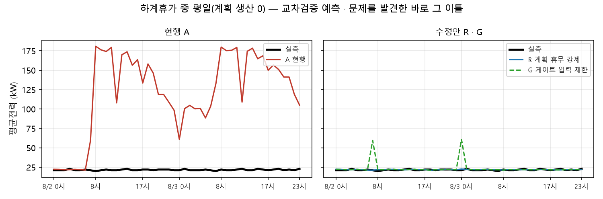
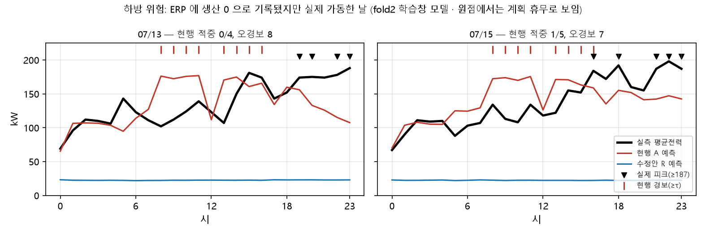
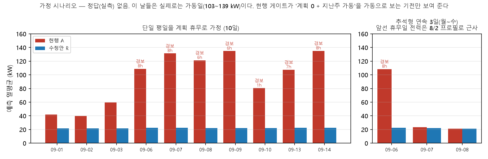

# 제안 — 확정 휴무일 예측 보정 (서비스 안전장치)

> **보관 메모 (2026-09-25)** — 바탕화면 `KAMP 피처실험/` 에서 실행한 기록을 저장소 `experiments/` 로 옮겼다. 스크립트는 경로만 저장소 기준으로 바꿨고(파이프라인 import 는 `_work/` 에서), `results/`·`figures/` 는 원래 실행 결과 그대로다. 새 위치에서 다시 돌려 같은 결과를 확인했다. 재실행 방법은 [`../README.md`](../README.md).

대상: 2단계 레짐 모델(3분류) 서빙 · 작성 2026-09-25 · 근거: `RESULTS.md`, 계획 `PLAN.md`

> **검증 상태**
> - 사전등록 기준으로는 **채택 없음(불합격)**이다.
> - 아래 수치는 모두 **사후 진단**이며, 문제를 발견한 바로 그 데이터(휴가 블록 1건)에서 나왔다. 홀드아웃(테스트)에는 해당 사례가 없다.
> - 따라서 이것은 검증된 정확도 개선이 아니다. **조건부 운영 안전장치** 제안이다.
> - 대회 제출본(모델·보고서 수치·제출 예측)은 바꾸지 않는다.

---

## 한눈에

| | |
|---|---|
| **문제** | 계획상 평일 휴무(생산 0)인 날을 1단계 분류기가 '가동'으로 보내, 평균전력을 08~17시 약 164 kW 로 예측했다(실측 21 kW). 8/2·8/3 이틀이 교차검증 오차의 34%다 |
| **유력한 기전 (사후)** | 학습 데이터의 "계획 휴무인데 전력은 가동 수준" 인 날(증강으로 덮어써진 2/11·3/1)에서, 분류기가 "지난주 같은 요일이 가동이면 계획 휴무라도 가동" 이라는 지름길을 배웠다 |
| **제안** | 운영자가 **완전 휴무를 명시적으로 확정한 날에만** 기저 상태 모델로 예측하는 서빙 옵션. 기본값은 꺼짐이다. 생산량 0 이나 공휴일표만으로는 적용하지 않고 경고만 낸다 |
| **기대 효과 (가정)** | 확정이 맞는 휴가형 휴무일에서 과대예측과 오경보가 사라진다. 계획상 휴무가 아닌 날(생산이 기록된 날)의 예측은 바뀌지 않는다 |
| **대가** | 확정이 틀리면 크게 틀린다. ERP 에 생산 0 으로 잘못 기록된 가동일은 22 kW 로 예측하고(실측 136 kW), 부분 가동 공휴일(설형)은 과소예측한다 |
| **전제** | ERP 에서 '계획 휴무' 와 '생산 미입력·결측' 을 구분할 수 있어야 한다. 이 데이터에는 그 구분이 없어 **확정 조건의 효과는 검증되지 않았다** |

---

## 1. 문제



- 8/2(월)·8/3(화)은 하계휴가 중이고 계획 생산은 0 이다.
- 현행 모델은 8/2 의 17시간, 8/3 의 24시간을 기저가 아닌 상태로 보냈다.
  - 평균전력 예측은 08~17시 평균 약 164 kW(시간별 최대 181), 피크 예측은 약 177 kW 였다.
  - 실측은 21.5 kW 였다.
- 이 48시간이 교차검증 1,279시간의 오차 중 **34%** 를 차지한다.

## 2. 유력한 기전 (사후 진단)

- 학습 기간의 "가동 주 다음 평일 계획 휴무" 는 5일이다. 그중 2일(2/11·3/1)은 증강으로 전력이 가동 수준이 되어 '가동'으로 학습됐다.
- fold3 을 증강 불일치 9일(216시간) 없이 다시 학습하면 문제의 날들이 가동으로 가지 않는다(그날 MAE 86·114 → 0.8).
- 한계
  - fold 하나의 실험이다.
  - "증강 불일치" 라벨은 휴리스틱이다. ERP 결측일과는 인건비 값 하나로만 구분된다.
- 뒤집어 보면, 현행이 ERP 결측 가동일(7/13·7/15)의 일평균을 맞히는 것도 같은 지름길 덕분이다. **계획을 믿게 만들면 계획이 틀린 날을 잃는다.**

## 3. 검토한 해결안 (모두 같은 교차검증에서 시도)

| 안 | 문제일 (휴가 평일) | 계획상 휴무가 아닌 날 | ERP 결측 가동일 | 설 2/12 (계획 0, 실측 47 kW, 학습 내) | 재학습 |
|---|---|---|---|---|---|
| (기각) 휴무 인지형 지연변수 | 일부만 | 악화 | — | — | 필요 |
| **R 확정 휴무 → 기저** | 해결 (MAE 0.8~1.0) | **변화 0 (구조상)** | ✗ 22 kW | ✗ 23 kW | 없음 |
| R-soft 가동만 막기 | 대부분 해결 (2.4~4.4) | 변화 0 | ✗ 22~35 kW | ✗ 25 kW | 없음 |
| G 분류기 입력을 달력·계획 22개로 | 해결 | 득실 혼재 (fold2 개선, fold5 악화) | ✗ 22~24 kW | — | 필요 |
| D 증강 불일치일 빼고 학습 | 해결 | 악화 (+0.24) | ✗ 22 kW | — | 필요 |

- 계획을 믿게 만드는 안은 모두 계획이 틀린 날 실패한다.
- R 은 그중 **확정 조건으로 적용 범위를 통제할 수 있는 유일한 안**이다. 계획상 휴무가 아닌 날을 건드리지 않고, 재학습이 없으며, 기존 번들을 그대로 쓴다.



## 4. 제안 — R + 확정 조건

1. **기본값은 꺼짐.** 켜기 전에는 현행과 한 행도 다르지 않다.
2. **완전 휴무의 명시적 확정이 있을 때만 적용한다.** 확정은 ERP 의 '계획 휴무' 플래그나 운영자 확인이다.
   - 생산량 0 만으로는 적용하지 않는다. ERP 결측 가동일과 구분할 수 없기 때문이다.
   - 공휴일표만으로도 적용하지 않는다. 평일 공휴일은 부분 가동했던 적이 있다(설 47 kW).
3. **확정이 없는 생산 0 은 현행 예측을 유지하고 경고를 낸다.** `PLAN_ZERO_UNCONFIRMED` 를 내고, 7일 전 같은 요일이 가동이었으면 `PLAN_ZERO_AFTER_OPERATING_WEEK` 도 붙여 운영자 확인을 요청한다.
4. **확정과 계획이 어긋나면 보정하지 않고 경고한다.** 확정인데 계획이 0 이 아니면 `SHUTDOWN_CONFIRMED_PLAN_NONZERO` 를 낸다.
5. **보정 범위.** 보정은 평균·최대 전력 예측과 그 경보(`peak_label`)에만 걸린다. 피크 분류기 경보(`peak_label_cls`)와 분위수는 보정되지 않는다. 분류기 경보를 끌지는 별도 정책 결정이다(`OVERRIDE_PARTIAL` 경고).
6. **기록.** 보정 여부와 행 수를 운영 로그에 남긴다. 다음 휴무 사건의 검증 자료가 된다.

> **제안한 개입과 평가한 개입은 다르다.**
> - 실험의 R 은 "계획 0 이면 무조건 보정" 이었다. 제안은 확정 조건을 더한 것이다.
> - 이 코드대로면 8/2·8/3 같은 하계휴가도 운영자가 확정해야 보정된다.
> - 보고서 4장의 운영 원칙 "휴무 기간에는 ERP 휴무 계획을 우선한다" 를 이번에 찾은 ERP 결측 위험에 맞춰 **"확정된 완전 휴무일"** 로 좁혀 코드로 옮긴 것이다. 그 원칙의 문구도 이 위험을 반영해 고쳐야 한다.

```python
from serving_plan_override import predict_day_plan_aware   # 시제품은 experiments/2026-09-25_gate_fix/ — 배포 시 serving/plan_override.py 로 옮긴다
current, served, meta = predict_day_plan_aware(
    bundle, history_df, plan_df, enabled=True,
    shutdown_confirmed=is_full_shutdown_confirmed)          # 반드시 bool. 'N'·'0' 같은 문자열은 거부한다
# meta: override_applied, rows_overridden, warnings → 운영 로그
```

## 5. 기대 효과와 대가 (사후 · 발견 데이터)

| 상황 | 현행 | 제안 (확정 후 보정) |
|---|---|---|
| **확정이 맞는 휴가형 휴무일** (7/31·8/2·8/3, 교차검증) | MAE 24.6 · 86.1 · 114.3 | 1.0 · 0.8 · 0.8 |
| 〃 경보 (τ 172.23 고정, `peak_label`) | 오경보 16건 | 0건 (피크 적중·미탐지 132/24 는 같음) |
| **확정이 틀린 날 — ERP 결측 가동일** (7/13·7/15) | 일평균은 맞음(135·140 vs 136), 피크는 9시간 중 1시간 적중, 오경보 15 | 22 kW 로 예측(MAE 113), 경보 0, 피크 1건 더 놓침. 이틀 오차 +약 4,070 kWh(문제일 개선의 약 3/4) |
| **부분 가동 공휴일** (설 2/12, 학습 내) | 48.8 kW (실측 47.3) | 23.4 kW (약 24 kW 과소) |

→ 이득과 대가가 비슷한 크기다. 그래서 **확정의 신뢰도가 전부**다. 확정 플래그를 얻을 수 없는 환경이라면 켜지 않는다.

**가정 시나리오** (그림 `fig2`): 정답은 없고 기전만 보여 준다.



- 9월 평일(실제로는 가동일)을 계획 휴무로 넣으면, 현행 분류기는 10일 중 7일을 가동으로 본다.
- 추석형 연속 3일에서는 첫날만 가동으로 본다. 이때 앞선 휴무일의 전력은 8/2 프로필로 근사했다.
- 현행의 이 예측이 오류인지는 **계획이 맞느냐에 달려 있다.** 이 시험은 "계획 0 + 지난주 가동" 을 가동으로 보는 **기전** 만 확인한다.

## 6. 검증 상태와 다음 단계

- **사전 판정은 채택 없음이다.** 효과가 사건 1건(3일)에만 있어 기준에 검정력이 없었다.
  - ②③⑤는 R 에 대해 자동 통과한다.
  - ④는 τ 재조정 때문에 떨어졌다.
  - ①은 CI 끝이 0 에 닿아 떨어졌다.
  - 불합격은 R 이 해롭다는 증거도, 좋다는 증거도 아니다.
- **교차검증 MAE 11.0 → 6.8 과 오경보 −16 은 성과로 내세우지 않는다.** 발견 데이터의 값이다.
- **다음 단계**
  1. **ERP 쪽 전제를 확보한다.** '계획 휴무' 와 '미입력·결측' 을 구분하는 플래그가 있어야 한다. 없으면 이 옵션은 켜지 않는다.
  2. **2차 사전등록.** 결정적 규칙에 맞는 개수 기준을 먼저 고정한다. 예: τ 고정 시 미탐지 증가 ≤ 1건, 바뀐 날 중 나빠진 날 0, 비휴무 변화 0, **ERP 결측형 사건 처리 필수**.
  3. **새 사건으로 검증한다.** 실제 추석이나 다음 휴가 데이터가 들어오면 옵션을 켜지 않은 채 현행과 보정안을 나란히 기록해 비교한다(그림자 운영).
- 생산량을 ERP 사전 계획으로 보는 것은 이 프로젝트 전체의 가정이다.

## 7. 재현

```bash
# 저장소 루트에서 (PYTHONHASHSEED=42, KAMP_FAST=0)
G=experiments/2026-09-25_gate_fix
python -X utf8 $G/run_gate_fix.py            # 사전등록 1차 판정 (약 3분)
python -X utf8 $G/posthoc_gate_fix.py        # 사후 진단 (약 4분)
python -X utf8 $G/posthoc_datafix.py         # 가설 D (약 2분)
python -X utf8 $G/posthoc_holiday_soft.py    # 공휴일·약한 보정 (약 1분)
python -X utf8 $G/serving_plan_override.py   # 서빙 시제품 + 구현 일치 확인 (outputs/models/full/eval 필요)
python -X utf8 $G/make_figures.py            # 그림
```
